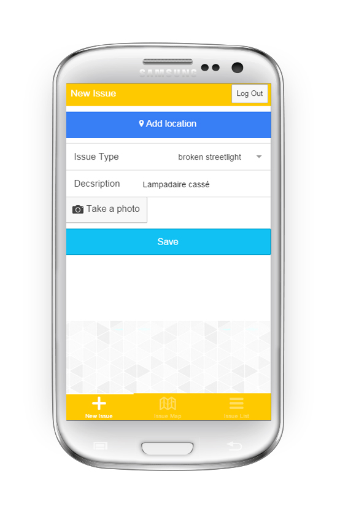
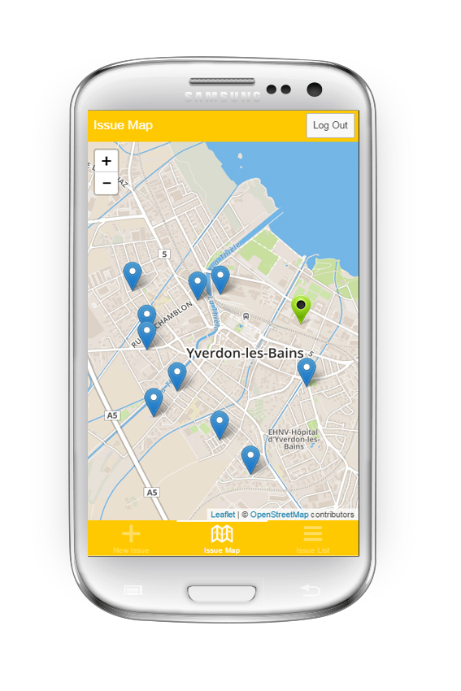
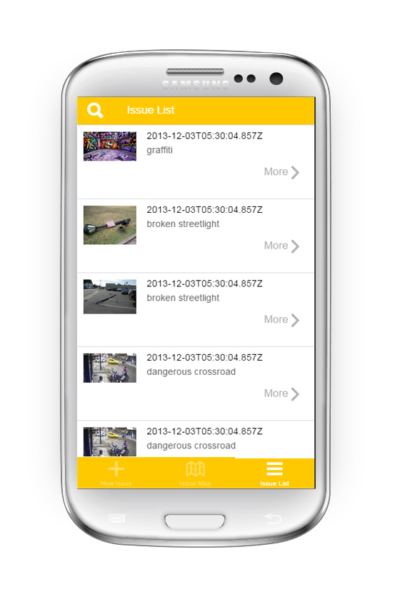
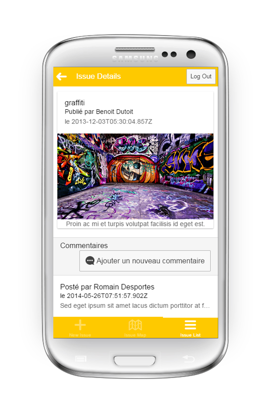
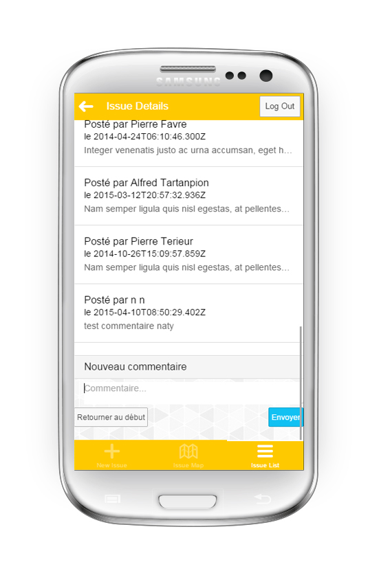

<html>
    <head>
        <title>Welcome</title>
<meta charset="unicode"><meta name="viewport" content="width=device-width, initial-scale=1">
        <meta name="description" content="Citizen Engagement - A pratical work experiment for iFlux"><link rel="stylesheet" href="/css/bootstrap.css">
        <link rel="stylesheet" href="/css/app.css"><link rel="stylesheet" href="/css/raml.css"><link rel="stylesheet" href="/css/highlight.github.min.css">
        </head>
    <body data-pinterest-extension-installed="cr1.35"><nav role="navigation" class="navbar navbar-default">
            

<button type="button" data-toggle="collapse" data-target="#navbarcollapse" class="navbar-toggle collapsed">
                        Toggle navigation</button>
                    <a href="#" class="navbar-brand">API Doc</a>

<ul class="nav navbar-nav"><li class="active"><a href="/">Home</a></li><li><a href="/blog">Blog</a></li><li><a href="/api">API Reference</a></li></ul>

</nav>
        

            

                

                    <h1>Welcome</h1>

                    

                    <h1>Smart City - Citizen Engagement</h1>
                    <h1>Utilisation de l'application</h1>
                    <h2>Premi&egrave;re utilisation</h2>
                    
Lors de la premi&egrave;re utilisation, l'utilisateur doit se loguer afin de pouvoir utiliser l'application.

                    <h2>Navigation</h2>
                    
En bas de la page, le menu permet de naviguer entre les 3 différentes pages, à savoir: new issue, issue map et issue list.

                    
Par défaut l'utilisateur arrive sur la page "New Issue" permettant d'ajouter une nouvelle Issue

                    <h2>New Issue</h2>
                    
                    
Afin de créer une nouvelle Issue, l'utilisateur doit renseigner les champs suivants:

                    <ul>
                        <li>Sa position</li>
                        <li>Le type d'Issue</li>
                        <li>La description</li>
                        <li>Prendre une photo</li>            
                    </ul>
                    <h2>Map</h2>
                    
                    
Cette carte indique à l'utilisateur la position des Issues (points bleus).

                    
Le point vert indique la position de l'utilisateur.

                    <h2>Issue List</h2>
                    
                    
Cette vue regroupe la liste de toutes les Issues. L'utilisateur peut voir les détails d'une Issue en cliquant sur le bouton "more" associé à celle-ci.

                    <h2>Issue Details</h2>
                    
                    
Voici l'aperçu d'une Issue. On peut Y voir ses informations importantes:

                    <ul>
                        <li>Son type</li>
                        <li>Sa date</li>
                        <li>Sa description</li>
                        <li>Son image</li>
                        <li>Ses commentaires</li>
                    </ul>
                    <h2>Comments</h2>
                    
                    
En bas de la page Issue Details,  l'utilisateur peut utiliser le formulaire à disposition pour écrire un nouveau commentaire sur l'Issue.

                

            

        

        

                
Built with&nbsp;<a href="https://github.com/lotaris/apidoc-seed">citizen-engagement-doc</a>&nbsp;- Citizen Engagement - A pratical work experiment for iFlux

Version: 0.0.1  |  Built April 10, 2015 1:25 PM

Maya Jeanmonod et Natalie Canonica

    </body></html>

